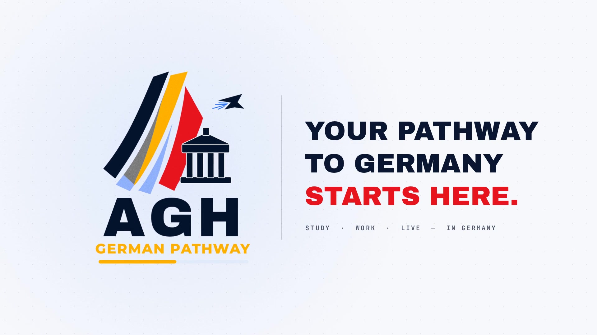

# AGH German Pathway — Motion Showreel

A 20-second, 1080p60 motion-graphics piece for **AGH German Pathway**, built entirely in code:
procedural canvas animation, rendered frame-by-frame with motion blur, plus a synthesized soundtrack
that hits on every cut, wipe and impact.

**Final video:** [`agh-showreel.mp4`](agh-showreel.mp4)



## Storyboard (120 BPM, every cut lands on the beat)

| Time | Scene | What happens |
|------|-------|--------------|
| 0:00–0:03 | **Intro** | Gold spark → track line. Kinetic type: *EVERY / JOURNEY / NEEDS A / PATHWAY.* The progress bar fills on the impact. |
| 0:02.4 | Ribbon wipe | Brand-coloured stripes (gold, red, sky) sweep across, reusing the logo's angle. |
| 0:03–0:06 | **Vision** | *STUDY. WORK. LIVE.* block reveals, *IN GERMANY* with a tri-colour underline, rotating AGH badge. |
| 0:05.5 | Iris | A circle opens from the last full stop onto the globe. |
| 0:06–0:10 | **Global** | Dotted-continent globe spins toward Europe. Flight arcs from around the world converge on Germany, which lights up gold. The camera then dives into Germany. |
| 0:10–0:13.5 | **Pathway** | Four steps on the brand progress bar: Sprache/Language (A1→C1), Studium/University, Visum/Visa (stamp), Karriere/Career. A plane rides the fill. |
| 0:13–0:18 | **Identity** | The progress track becomes the logo's bar. The logo then builds piece by piece: stripes grow, the building assembles, the plane swoops in, *AGH* slams down (shake, rings, confetti), *GERMAN PATHWAY* tracks in, and a shine passes over it. |
| 0:18–0:20 | **End card** | The logo slides left. *YOUR PATHWAY / TO GERMANY / STARTS HERE.* |

## Files

- `index.html` + `showreel.js`: the animation. Open `index.html` through any static server for a live
  preview (click to restart, add `?t=15.5` to freeze a frame).
- `globe-dots.js`: land dot data (Natural Earth 1:50m via `world-atlas`, Germany flagged).
- `audio.cjs`: procedural soundtrack (kicks, bass, pads, bells, whooshes, reverb, side-chain).
- `render.cjs`: headless Chromium (Playwright) → ffmpeg renderer.
- `fonts/`: Archivo Black, Montserrat, JetBrains Mono (SIL Open Font License).

## Re-render

```bash
npm i -g playwright            # or use an existing install
node audio.cjs                 # → out/soundtrack.wav
NODE_PATH=$(npm root -g) node render.cjs          # → out/agh-showreel.mp4 (1080p60, 4× motion-blur)
NODE_PATH=$(npm root -g) node render.cjs --stills 2,15.5   # quick PNG checks
```
