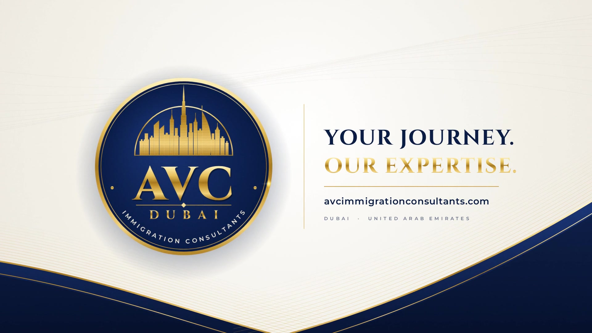

# AVC Immigration Consultants Dubai: Motion Showreel

A 24-second, 1080p60 motion piece for **AVC Immigration Consultants, Dubai**, built entirely in code.
It's a procedural canvas animation rendered frame by frame with 4× motion blur. The soundtrack is
synthesized in D Hijaz with a plucked "oud" and darbuka-style percussion, and it hits on every cut.

**Final video:** [`avc-showreel.mp4`](avc-showreel.mp4)



## Storyboard (120 BPM)

| Time | Chapter | What happens |
|------|---------|--------------|
| 0:00–0:03 | **I · Prologue** | An anamorphic gold light streak draws the frame. Serif kinetic type: *NEW COUNTRY. / NEW CAREER. / NEW BEGINNING.* The last line is metallic gold with a sparkle burst. |
| 0:03 | Silk wave | A gold-lined wave in the banner's style rises and reveals Dubai at night. |
| 0:03–0:07 | **II · Dubai** | A gold skyline (Burj Khalifa, Burj Al Arab, Emirates Towers) rises from the water with reflections, searchlights, a crescent moon and a giant *DUBAI* outline. A star flare lights the Burj's tip. |
| 0:07 | Iris | Opens from the Burj's spire. |
| 0:07–0:11 | **III · The World** | A dotted globe turns to the UAE. Gold flight paths run between Dubai and world cities. *ONE CITY. A world of POSSIBILITIES.* |
| 0:11 | Light slit | A golden horizontal light slit opens the next scene. |
| 0:11–0:16 | **IV · The Process** | A passport flies in over a guilloche rosette and opens to a visa page. Steps tick off (Consultation, Documentation, Application, Approval), then an *APPROVED* stamp slams down. |
| 0:16 | Match cut | The passport closes and the camera dives into its emblem. |
| 0:16–0:21 | **V · The Mark** | The emblem builds: the gold ring draws itself, then the arch, the skyline rising inside it, *AVC* landing hard, the divider and diamond, *DUBAI* tracking in, and the curved *IMMIGRATION CONSULTANTS*. Banner-style navy and gold waves flow in, and a shine sweeps across. |
| 0:21–0:24 | End card | *YOUR JOURNEY. / OUR EXPERTISE.* · avcimmigrationconsultants.com |

## Files

- `index.html` + `showreel.js`: the animation. Serve the folder and open it for a live preview
  (click to restart, `?t=18.6` freezes a frame).
- `audio.cjs`: the procedural soundtrack, which writes `out/soundtrack.wav`.
- `render.cjs`: the headless Chromium (Playwright) to ffmpeg renderer.
- `globe-dots.js`: Natural Earth land points. `fonts/`: Cinzel, Cormorant Garamond, Montserrat (OFL).

## Re-render

```bash
node audio.cjs
NODE_PATH=$(npm root -g) node render.cjs                 # → out/avc-showreel.mp4
NODE_PATH=$(npm root -g) node render.cjs --stills 15,19  # quick PNG checks
```
